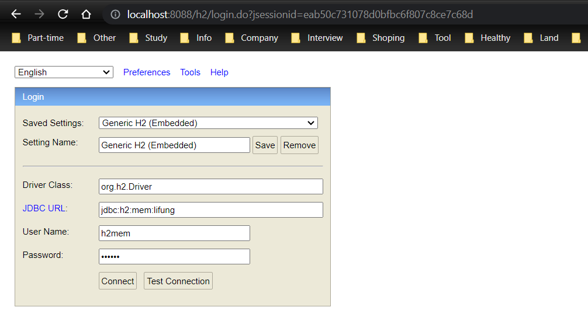

# Welcome to small Task TODO Spring Application 🚀

### 🚀 You can set up and build project step-by-step likes:
- Server port: 8088
- Run spring application by command
`mvn spring-boot:run`
- Enter URL: http://localhost:8088
- Config H2 db mem-cache like:
  - Enter URL: http://localhost:8088/h2 and config info with bellow info:
    - username: h2mem
    - password: 123456
  
  

- Test 2 requests with postman like:
  - Request get all tasks TODO with cUrl:
    ```
    curl --location 'http://localhost:8088/api/v1/tasks'
    ```
  - Add new task with status = TODO with cUrl:
    ```
      curl --location 'http://localhost:8088/api/v1/tasks' \
      --header 'Content-Type: application/json' \
      --data '{
      "content": "Task Monday"
      }'
    ```